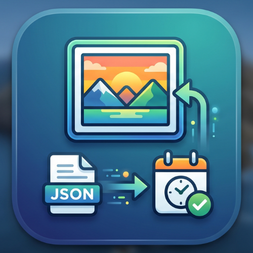

<div align="center">
  

  <h1>Google Takeout Connect</h1>

  <p>Google Takeout の写真・動画から、失われた撮影日時を取り戻す。</p>

  
  
  
  

  <br />

  [ダウンロード](#-ダウンロード) · [使い方](#-使い方) · [開発者向け](#-開発者向け)

</div>

---

## 概要

Google フォトから写真をエクスポートすると、すべてのファイルの日時が「ダウンロード日」に書き換わってしまいます。  
**Google Takeout Connect** は、Takeout に同梱される `.json` ファイルから撮影日時を読み取り、メディアファイルに自動で書き戻すデスクトップアプリです。

コマンドラインは一切不要。フォルダを選んでボタンを押すだけで完了します。

---

## ✨ 機能

| 機能 | 詳細 |
|---|---|
| 📅 撮影日時の復元 | JSON サイドカーから `photoTakenTime` を読み取り EXIF に書き込み |
| 🖼️ 画像対応 | JPEG / PNG / HEIC / WebP / TIFF / DNG / CR2 / NEF / ARW |
| 🎬 動画対応 | MP4 / MOV / MKV / M4V / 3GP など |
| 🗂️ タイムスタンプ更新 | エクスプローラーの「更新日時」「作成日時」も撮影日時に変更 |
| 🔗 ファイル名マッチング | 長いファイル名の切り詰めや `-edited` 系の派生ファイルにも対応 |
| 📋 処理ログ | スキップ理由・エラーをリアルタイム表示 |
| 📦 同梱バイナリ | ExifTool・ffmpeg を内蔵。追加インストール不要 |

---

## 📥 ダウンロード

[Releases ページ](https://github.com/Mr-SuperInsane/GoogleTakeoutConnect/releases/latest)から OS に合ったファイルをダウンロードしてください。

| OS | ファイル |
|---|---|
| Windows (64bit) | `Google.Takeout.Connect_x.x.x_x64_ja-JP.msi` |
| macOS (Apple Silicon / M1以降) | `Google.Takeout.Connect_x.x.x_aarch64.dmg` |
| macOS (Intel) | `Google.Takeout.Connect_x.x.x_x64.dmg` |

### インストール

**Windows**  
`.msi` をダブルクリックしてインストール。  
> SmartScreen の警告が出た場合は「詳細情報」→「実行」を選択してください。

**macOS**  
`.dmg` を開いてアプリを `Applications` フォルダにドラッグ。  
> 初回起動時に警告が出た場合は `システム設定` → `プライバシーとセキュリティ` から「このまま開く」を選択してください。

---

## 🚀 使い方

1. アプリを起動する
2. **入力フォルダ** に Google Takeout を展開したフォルダを選択
3. **出力フォルダ** に書き出し先を選択
4. **「処理開始」** をクリック
5. 完了後、ログで処理結果を確認

> 元のファイルは変更されません。出力フォルダに新しいファイルが生成されます。

---

## 🛠 技術スタック

| レイヤー | 技術 |
|---|---|
| フレームワーク | [Tauri v2](https://tauri.app/) |
| フロントエンド | React + TypeScript + Tailwind CSS |
| バックエンド | Rust |
| 画像メタデータ | [ExifTool](https://exiftool.org/) |
| 動画メタデータ | [ffmpeg](https://ffmpeg.org/) |
| ビルド | GitHub Actions (Windows / macOS ARM / macOS Intel) |

---

## 💻 開発者向け

### 必要なもの

- [Node.js](https://nodejs.org/) 22+
- [Rust](https://rustup.rs/)
- [ExifTool](https://exiftool.org/) (PATH に通す)
- [ffmpeg](https://ffmpeg.org/) (PATH に通す)

### セットアップ

```bash
git clone https://github.com/Mr-SuperInsane/GoogleTakeoutConnect.git
cd GoogleTakeoutConnect
npm install
```

バイナリをセットアップ（Windows）:

```powershell
.\scripts\setup-dev.ps1
```

開発サーバー起動:

```bash
npm run tauri dev
```

### リリース

`v` から始まるタグをプッシュすると GitHub Actions が自動でビルド・リリースします。

```bash
git tag v1.0.0
git push origin v1.0.0
```

---

## 📄 ライセンス

[MIT License](./LICENSE)
